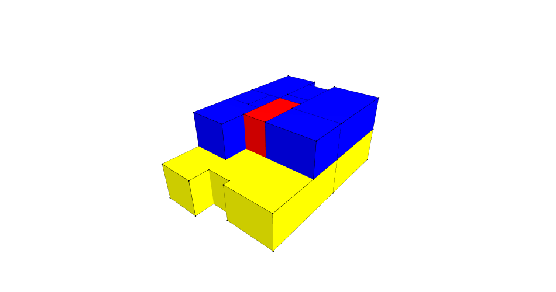
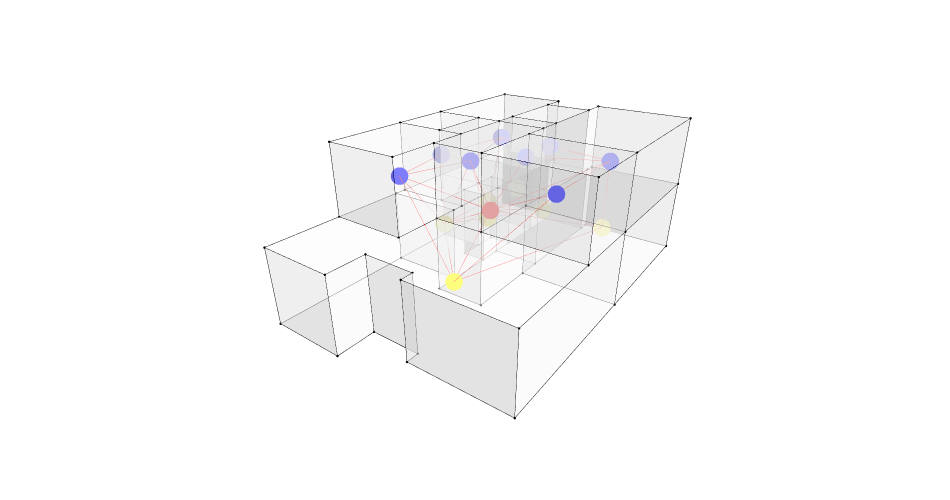
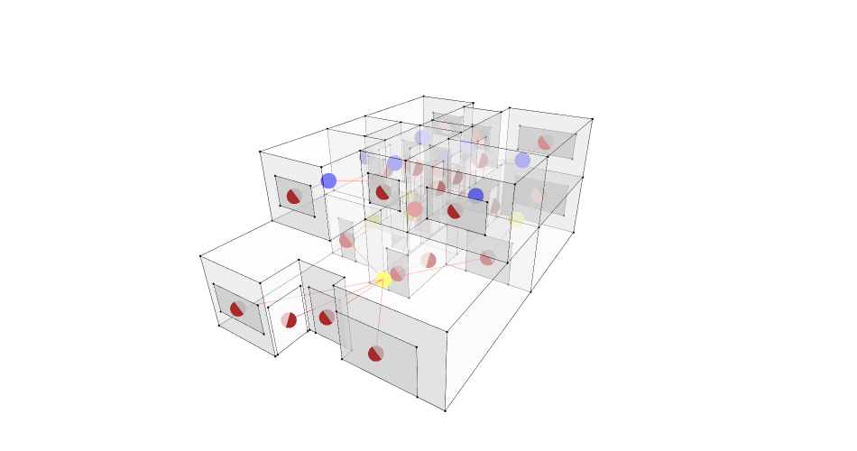
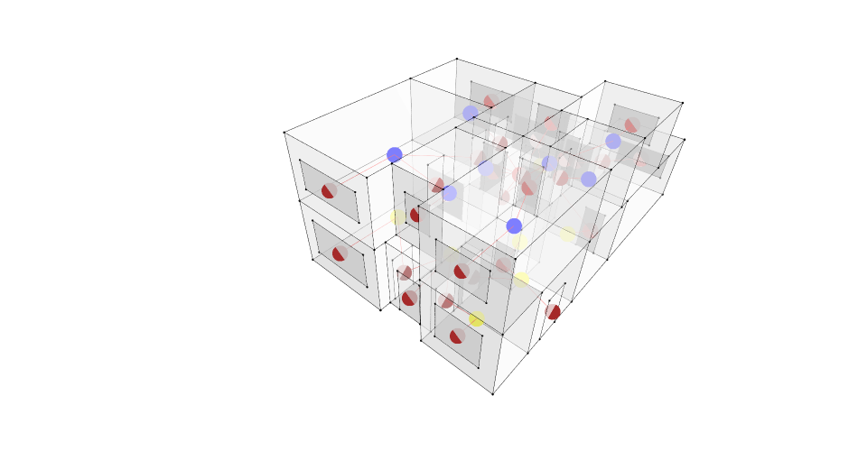
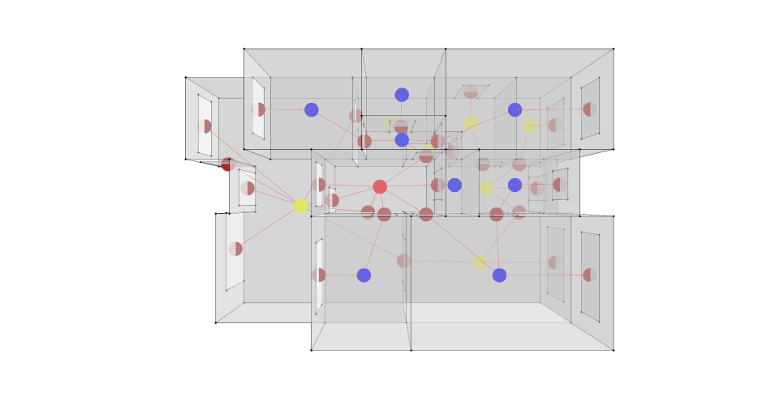

# Graph ML — Assignment 1
**Author:** Marina Osmolovska  
**Course:** AIA Graph ML, MaCAD 2025 — Semester 3  

---

## Overview

This project explores **geometric and element-based representations** of architectural space using Graph Machine Learning techniques. A 3D building model is parsed into a topological cell complex, rooms are semantically labelled, and spatial relationships are encoded as graphs — first through direct face adjacency, then through architectural apertures (doors and windows).

All work is contained in [`GraphML_MarinaOsmolovska_A1.ipynb`](GraphML_MarinaOsmolovska_A1.ipynb).

---

## Project Logic

### Step 1 — Import 3D Geometry

The house model is exported from Rhino as an OBJ file (`MO_House.obj`), where each room is a separate object. The file is loaded with `Topology.ByOBJPath()`.

### Step 2 — Build Cells and Label Rooms

Each imported object's faces are assembled into a closed 3D `Cell`. A semantic label is read from the object's dictionary (the `"name"` key) and a colour attribute is assigned:

| Room type | Colour |
|-----------|--------|
| Room_1 / Lobby | Yellow |
| Staircase | Red |
| Other rooms | Blue |



### Step 3 — Assemble a CellComplex

All cells are merged into a `CellComplex`. Semantic dictionaries (name, color, vertex_size) are transferred to each cell using selector vertices, making the attributes accessible for graph construction.

### Step 4 — Derive the Adjacency Graph

`Graph.ByTopology()` converts the CellComplex into a graph where:
- **Nodes** = rooms (positioned at each room's internal centroid vertex)
- **Edges** = two rooms share a face (they are physically adjacent)

This graph captures the **topological neighbourhood** of the building.



### Step 5 — Create Door Apertures

Door geometry is loaded from `MO_Doors.obj`. Each door face is tagged with a dictionary (`type=door`, `color=brown`) and stored as an aperture.

### Step 6 — Create Window Apertures

External vertical faces are extracted from the `CellComplex.Decompose()` result. Each external face is scaled to 50% of its original size about its centroid to produce a window aperture.

### Step 7 — Build the Aperture-Based Access Graph

Apertures (doors + windows) are added to the house topology with `Topology.AddApertures()`. A new graph is then derived using:

```python
Graph.ByTopology(houseWithWindows, viaSharedApertures=True, toExteriorApertures=True, direct=False)
```

This encodes **access relationships**: two rooms are connected if they share a door or window, not just a wall. Exterior apertures also connect interior rooms to the outside.







---

## Files

| File | Description |
|------|-------------|
| `GraphML_MarinaOsmolovska_A1.ipynb` | Main notebook |
| `MO_House.obj` | 3D house model (rooms as separate objects) |
| `MO_Doors.obj` | Door aperture geometry |
| `MO_Windows.obj` | Window aperture geometry |
| `3D_GraphML_A1_MO.3dm` | Source Rhino file |
| `3D_GraphML_A1_MO_gh.gh` | Grasshopper definition |
| `color_scheme.png` | Color-coded room geometry |
| `adjacency_graph.png` | Direct face-adjacency graph |
| `graph_1.png` / `graph_1_2.png` / `graph_1_3.png` | Aperture-based access graph views |

---

## Requirements

```
topologicpy >= 0.9.18
```

Install:

```bash
pip install topologicpy
```

---

## Key Concepts

- **CellComplex** — a topologically consistent 3D solid model where cells share faces without duplication
- **Adjacency graph** — nodes = rooms, edges = shared walls (direct physical contact)
- **Access graph** — nodes = rooms, edges = shared apertures (doors/windows — actual passage possible)
- **Apertures** — sub-topologies (faces) embedded in the boundary of cells, representing openings

