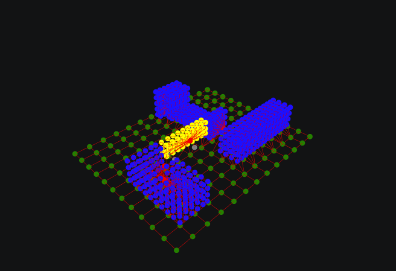
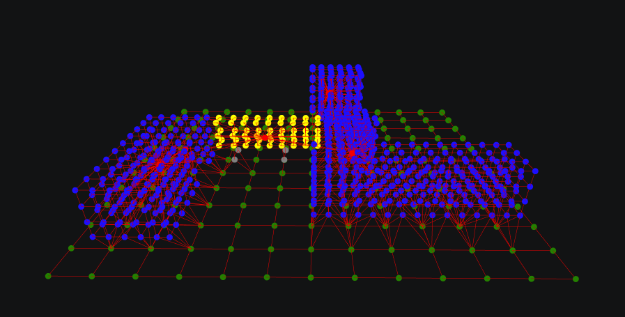
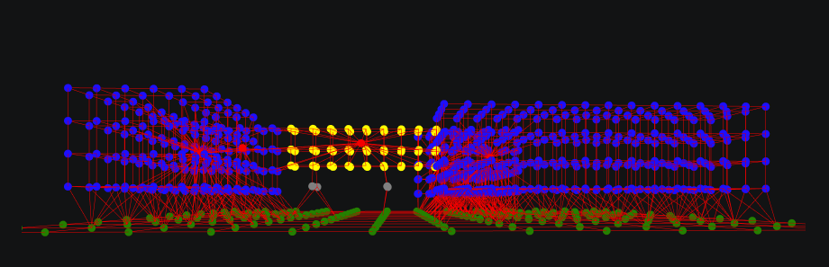
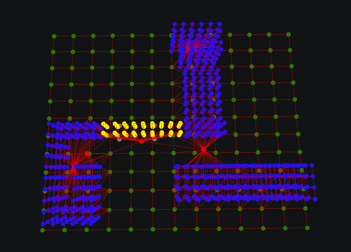
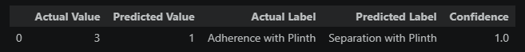

# Assignment 3 — Building Graph Representation

A building modelled in Rhino is converted into a graph data structure and classified by a pre-trained Graph Neural Network. The building is decomposed into typed volumetric cells — ground slab, columns, offices, core, and plinth — which become nodes in a graph where edges encode spatial adjacency between volumes.

---

## Notebook 1 — Creating the BGR Graph

### 1. Importing Geometry

Four OBJ files exported from Rhino are loaded via `Topology.ByOBJPath`: ground slab, columns, office volumes, core, and plinth. Each file corresponds to one building component layer.

---

### 2. Assigning Cell Types

Each mesh is converted into closed volumetric cells through `Topology.SelfMerge`. A dictionary carrying the cell type (integer 0–4), name, and colour is attached to each cell's internal vertex, producing a set of selector points used in the next step.

| cell_type | name    | colour |
|-----------|---------|--------|
| 0         | ground  | green  |
| 1         | column  | gray   |
| 2         | plinth  | yellow |
| 3         | office  | blue   |
| 4         | core    | red    |

---

### 3. Building the CellComplex

All cells are merged into a single `CellComplex` via `Topology.SelfMerge(Cluster.ByTopologies(all_cells))`. Shared faces between adjacent volumes are recognised, forming a unified topological model.

---

### 4. Transferring Dictionaries

`Topology.TransferDictionariesBySelectors` maps the cell-type metadata from the selector points (Step 2) onto the merged CellComplex cells. Each cell in the model now carries its type and colour.

---

### 5. Adjacency Graph and Node Features

`Graph.ByTopology(model)` derives the adjacency graph: each cell becomes a node, each shared face becomes an edge. One-hot vectors of length 5 — `feature_00` through `feature_04` — are computed per node from the cell type and stored as vertex attributes.

---

### 6. Exporting to CSV

`Graph.ExportToCSV` writes the dataset to the output folder:

- `graphs.csv` — one row per graph, including a manually assigned label  
- `nodes.csv` — one row per node with cell type and one-hot features  
- `edges.csv` — one row per edge (source and destination node IDs)

The `label` field in `graphs.csv` is filled manually before prediction, representing the building–ground relationship as assessed by the author.

---

## Notebook 2 — Predicting the Building–Ground Relationship

The exported dataset is loaded into `PyG.ByCSVPath` and passed to a pre-trained GraphSAGE model (`bgr_model.pt`). The model predicts the graph label from node features and adjacency structure alone — no geometric coordinates are used.

**Label options:**

| Value | Relationship            |
|-------|-------------------------|
| 0     | Separation              |
| 1     | Separation with Plinth  |
| 2     | Adherence               |
| 3     | Adherence with Plinth   |
| 4     | Interlock               |

The building was assessed as **Adherence with Plinth (3)**: office and core volumes sit at ground level, with a plinth element running between them. The model returned **Separation with Plinth (1)**. The divergence is consistent across similar student submissions and reflects a structural ambiguity at the graph level — when the plinth node mediates most adjacency between the building mass and the ground slab, the connectivity pattern overlaps with separation-type configurations present in the training data.

