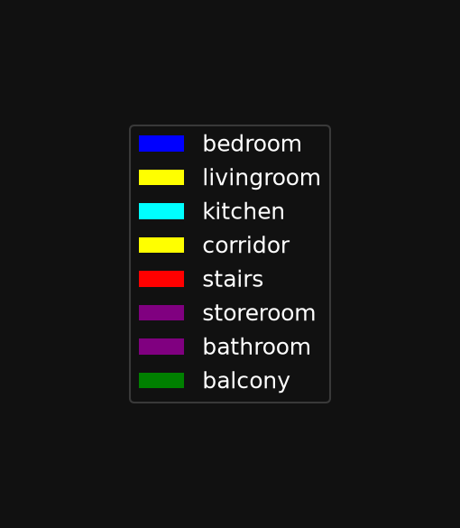
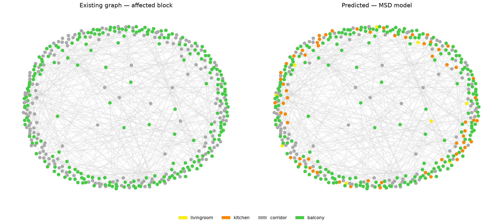
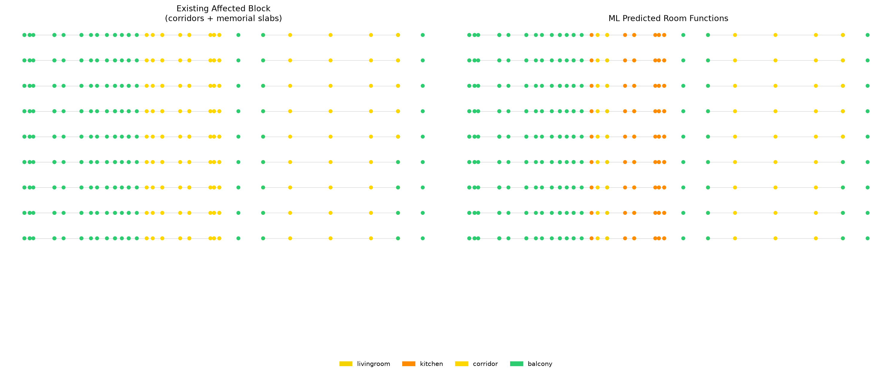

# Memorial in Topology
## A Graph Machine Learning Reading of Wartime Loss in Kyiv

**Marina Osmolovska — MaCAD S3 Graph ML Final Project**
**IAAC, Master in Advanced Computation for Architecture and Design, Semester 3**

---

## Project Overview

A Soviet-era 87-02 panel block-section in Kyiv — nine storeys of repeating flats — lost half of one section to a Russian rocket strike. The staircase core survived. It now opens onto ruins: half-destroyed apartments on one side, a vertical void where the mirrored flats used to be. The surviving stair leads, in graph terms, to nothing.

This project does not reconstruct what was lost. Instead, it **reads the lost apartment as a spatial graph** and translates those relationships into a memorial form.

Each room that no longer exists returns as a **floor slab only** — no walls, just the trace of the floor, at a height determined by the room's topological distance from the entrance. The further a room was from the apartment door, the lower (or higher) its slab in the memorial promenade. The original door positions become **step-bridges** between slabs of different heights. The gaps between slab edges are the missing walls. The bridges are the surviving connections.

**The promenade is the access graph of the lost apartment, made walkable.**

The graph analysis — built in [TopologicPy](https://github.com/wassimj/topologicpy) from a 3D Rhino model, converted to NetworkX, and finally run through a pretrained GraphSAGE node classifier — both drives the design decisions and questions what these rooms "become" now that they open onto an intervention rather than a destroyed flat.

---

## Concept Diagram

<!-- PLACEHOLDER: Add concept diagram here (e.g. annotated section drawing showing the promenade logic: depth → slab height, door position → step-bridge, gap → lost wall) -->

---

## Pipeline Overview

```
Rhino model              Phase 1–2: closed room solids + door aperture faces
      ↓
TopologicPy (Phase 3)    CellComplex → adjacency graph (g1) + access graph (g2)
      ↓
NetworkX (Phase 4)       depth-from-entrance, degree, betweenness, closeness
      ↓
Rhino design (Phase 5)   slab Z = –step × depth, door positions → step-bridges
      ↓
TopologicPy (Phase 6)    combined graph: intact section + damaged block + memorial
      ↓
S06-15B (Phase 8a)       CheckMSDGraphPreparation → EncodeMSDGraphFeatures → CSV
      ↓
S06-15C (Phase 8b)       pretrained GraphSAGE → predict room types in damaged block
```

---

## Phase 1–2: Geometric Modeling in Rhino/Grasshopper

The model follows one rule: **one closed solid per room, shared faces instead of walls.**
Adjacent rooms touch face-to-face with zero gap — the shared face is the wall. Thickness is not modeled. This is the topology that TopologicPy reads.

**The intact section** spans party wall to party wall — the full width of one repeating block-section, 9 storeys. Two apartment types repeat per floor (Type A: 2+1 rooms, Type B: 3 rooms), plus the staircase as a single tall box running the full building height.

**Door aperture faces** are placed on shared walls and exported in three separate OBJ files, one per door type:

| File | `door_type` | Meaning |
|---|---|---|
| `doors_entrance.obj` | `entrance_door` | Apartment entrance from landing (36 total, 4 per floor × 9 floors) |
| `doors_door.obj` | `door` | Room-to-room leaf doors (252 total) |
| `doors_passage.obj` | `passage` | Open threshold — landing to staircase (18 total, 2 per floor × 9 floors) |

The staircase box is one tall solid, not per-floor. This means vertical access exists only through the stair: 18 `passage` apertures connect each landing to the staircase at each floor level, making the stair the only vertical link in the graph — which is exactly why it dominates betweenness centrality.

<!-- PLACEHOLDER: Add Rhino screenshots here — intact section model showing room solids colored by type (top view + axonometric) -->

**The damaged block** models the same section geometry on the other side of the staircase, with key differences:
- All surviving rooms in both affected flats are labeled `corridor` (neutral placeholder for ML)
- Completely destroyed rooms are replaced by **memorial slabs** labeled `balcony` (open-sky slab, zoning class: outdoor/semi-outdoor)
- Door bridges at original door positions are labeled `stairs`

<!-- PLACEHOLDER: Add Rhino screenshots of the damaged block + memorial intervention — the depth-mapped slabs at varying Z heights, step-bridges, gaps where walls were. Also add the newly created images showing the slabs symbolising the lost apartments. -->

---

## Phase 3: Building the 3D Access Graph

**Notebook:** [`MO_Final_Phase3_AccessGraph.ipynb`](MO_Final_Phase3_AccessGraph.ipynb)

TopologicPy processes the intact section OBJ files into a spatial graph. The key step is the switch between two graph types that share almost identical code:

| Graph | `direct` | `viaSharedApertures` | What it connects |
|---|---|---|---|
| **Adjacency graph (g1)** | `True` | — | Every pair of rooms sharing any face, including floors/ceilings |
| **Access graph (g2)** | `False` | `True` | Only rooms sharing a door aperture |

The adjacency graph includes through-slab connections — bedrooms on floor 3 connect to bedrooms on floor 4. The access graph only has edges where a door exists, which correctly reflects movement. The staircase becomes the only vertical link.

```
306 apertures total
  entrance_door: 36 apertures (4 entrances × 9 floors)
  door:         252 apertures (28 doors × 9 floors)
  passage:       18 apertures (2 landings × 9 floors)
```

### Intact Section — Geometry

<!-- PLACEHOLDER: Export from Phase 3 notebook, Cell 17 (cell-08-showgeo) — Topology.Show of house_cells colored by room type -->

### Intact Section — Adjacency Graph (g1)

<!-- PLACEHOLDER: Export from Phase 3 notebook, Cell 21 (cell-10-showadj) — Topology.Show of g1 overlaid on geometry, colored by room type -->

### Intact Section — Access Graph (g2)

The access graph (g2) is the analytical core. The staircase node is the only vertical connector. Bedrooms and bathrooms become leaves; corridors and the landing become the circulation spine. Each node carries `room_type` and each edge carries `door_type` — the two keys the ML pipeline reads.

<!-- PLACEHOLDER: Export from Phase 3 notebook, Cell 29 (cell-14-showaccess) — Topology.Show of house + apertures + g2, colored by room type -->

---

## Phase 4: Spatial Analysis

**Still in:** [`MO_Final_Phase3_AccessGraph.ipynb`](MO_Final_Phase3_AccessGraph.ipynb)

Centrality and depth metrics are computed via BFS directly on the TopologicPy graph (NetworkX centrality methods were not available in the installed version). The key metric driving the design is **depth from entrance** — the hop count from the staircase node to each room via the access graph.

| Metric | Design use |
|---|---|
| `depth_from_entrance` | Drives slab height in Phase 5: `Z = –step × depth` |
| `degree` | Reveals circulation hubs vs. dead-end rooms |
| Betweenness | Confirms staircase as the single gateway to all floors |

**Sample depth table for one apartment (floor 6, flat A):**

| Room | Depth | Degree | Notes |
|---|---|---|---|
| `corridor_d_6_11` | 0 | 7 | Entrance landing — the graph origin |
| `corridor_d_6_10` | 1 | 2 | Apartment hall |
| `corridor_d_6_2`  | 1 | 2 | Apartment hall (flat B) |
| `balcony_d_6_15`  | 2 | 6 | Memorial slab — depth 2 |
| `corridor_d_6_9`  | 2 | 2 | Surviving room |
| `corridor_d_6_7`  | 2 | 2 | Surviving room |
| `balcony_d_6_16`  | 4 | 4 | Memorial slab — depth 4 |
| `balcony_d_6_14`  | 4 | 7 | Memorial slab — depth 4 |

Rooms at depth 4, 6, 8, 10, 12 in the damaged section are the memorial slabs — their depth values are fed directly into the slab height formula in Phase 5.

---

## Phase 5: The Memorial Design (Rhino/Grasshopper)

This phase is a direct translation of the depth table into architectural form:

```
slab_Z = –SLAB_STEP_M × depth_from_entrance
```

The deeper a room was from the entrance, the lower (more underground) its memorial slab. A room at depth 2 sits near ground level; one at depth 12 descends to the lowest point of the promenade.

**Design rules:**
- Each destroyed room → a floor slab at `slab_Z`, perimeter shrunk inward by the missing wall thickness
- Each original door position → a thin step-bridge connecting two slabs at different heights
- Height difference between two connected rooms → the step height on that bridge
- No walls, no ceiling: the gaps between slab edges are the missing partitions
- `balcony` cells: the memorial slabs (open sky, no enclosure)
- `stairs` cells: the step-bridges (functional connector at door positions)

<!-- PLACEHOLDER: Add Rhino/GH screenshots showing the depth-mapped slab promenade — perspective view, section, plan. Show the descending sequence of floors. Add separately: the newly modeled slabs symbolising the lost apartments. -->

---

## Phase 6: Combined Graph

**Notebook:** [`MO_Final_Phase6_CombinedGraph.ipynb`](MO_Final_Phase6_CombinedGraph.ipynb)

The combined graph merges the intact section with the damaged block + memorial intervention into one CellComplex. This is where the ML question lives: given the changed topology (the memorial's balcony and stair nodes now connect into the surviving rooms), what function does each surviving room read as?

**Room type assignments in the combined model:**

| Zone | `room_type` | Reason |
|---|---|---|
| Intact section | real type (`bedroom`, `kitchen`, …) | Fully known — not predicted |
| Damaged block surviving rooms | `corridor` | Neutral placeholder; ML predicts their new function |
| Memorial slabs | `balcony` | Outdoor/semi-outdoor, zoning class 3 |
| Step-bridges | `stairs` | Service/functional, zoning class 2 |

Using `corridor` (not `unknown`) for all surviving damaged rooms keeps every node in-distribution for the pretrained model. All surviving rooms in both affected flats receive this label — not just the rooms at the cut edge — because both flats lost a room or an entrance, and the design intent is to let the graph structure, not the pre-strike history, determine new functions.

**Combined model statistics:**
```
596 cells loaded (intact + damaged + intervention)
612 apertures total
  entrance_door: 72 (36 intact + 36 damaged)
  door:         504 (252 + 252)
  passage:       36 (18 + 18)
```

### Combined Section — Geometry

<!-- PLACEHOLDER: Export from Phase 6 notebook, Cell 16 (cell-08-showgeo) — Topology.Show of all house_cells, intact + damaged, colored by room type -->

### Combined Section — Adjacency Graph (g1)

<!-- PLACEHOLDER: Export from Phase 6 notebook, Cell 20 (cd3125b0) — Topology.Show of g1 only (no geometry), colored by room type -->

### Combined Section — Access Graph (g2)

<!-- PLACEHOLDER: Export from Phase 6 notebook, Cell 29 (cell-14-showaccess) — Topology.Show of house + apertures + g2, colored by room type -->

<!-- PLACEHOLDER: Export from Phase 6 notebook, Cell 30 (7d1f5bbc) — Topology.Show of g2 only, colored by room type -->

---

## Phase 7: Intact vs Damaged — Comparing the Two Graphs

The comparison between the intact section graph and the combined graph is the analytical heart of the project. It makes the loss **legible as topology.**

In the intact graph, the staircase is the sole gateway: high betweenness, all routes pass through it. The two apartment types create two symmetric clusters of rooms branching off each landing. Depth from entrance reaches 3–4 hops to the deepest bedrooms and bathrooms.

In the combined graph, the same staircase now leads, on the damaged side, into a different spatial structure: corridors transition directly to balcony slabs; the "apartment" branches into a descending memorial promenade. The depth range expands to 12 hops (the deepest memorial slabs), and the degree distribution changes — balcony nodes have high degree because each slab connects to multiple surviving corridors and bridges.

This collapse of the mirrored symmetry — one side intact, one side open and descending — is the topological record of the strike.

---

## Phase 8: ML Node Classification

**Notebook:** [`S06-15C GML Predict MSD Graph.ipynb`](S06-15C%20GML%20Predict%20MSD%20Graph.ipynb)

### Feature Schema

The pretrained GraphSAGE model (Modified Swiss Dwellings) sees a **7-dimensional node feature vector** — no geometry, no area, no coordinates:

| Feature | Description |
|---|---|
| `feat_zoning_type_0` | 1 if `bedroom` (private/static) |
| `feat_zoning_type_1` | 1 if `livingroom`, `kitchen`, `dining`, `corridor` (living/dynamic) |
| `feat_zoning_type_2` | 1 if `stairs`, `storeroom`, `bathroom` (service/functional) |
| `feat_zoning_type_3` | 1 if `balcony` (outdoor/semi-outdoor) |
| `feat_connectivity_0` | Proportion of incident edges that are `passage` |
| `feat_connectivity_1` | Proportion of incident edges that are `door` |
| `feat_connectivity_2` | Proportion of incident edges that are `entrance_door` |

The surviving damaged-block rooms receive `corridor` → zoning one-hot `[0,1,0,0]`. The model must then disambiguate among `livingroom`, `kitchen`, `dining`, `corridor` for each room, based on its connectivity pattern and what its neighbours (balcony slabs, stair bridges) look like via GraphSAGE message passing.

### Dataset

Exported to `dataset/`:

```
graphs.csv: 1 graph
nodes.csv:  596 nodes (454 intact section rooms + 162 damaged/intervention nodes)
edges.csv:  594 undirected edges (1188 directed)
```

Node label distribution:
```
label 0 (bedroom):    54 nodes
label 1 (livingroom): 36 nodes
label 2 (kitchen):    36 nodes
label 4 (corridor):  162 nodes  ← 162 surviving damaged-block rooms (placeholder)
label 5 (stairs):      2 nodes
label 6 (storeroom):  18 nodes
label 7 (bathroom):   72 nodes
label 8 (balcony):   216 nodes  ← 216 memorial slabs (designed, not predicted)
```

### Color Legend



### Predictions for the Damaged Block

The model predicts all 596 nodes. For the 162 surviving damaged-block rooms (y_true = 4 / `corridor` placeholder), **y_pred is the meaningful result** — what the model reads these spaces as, given their new connections to the memorial intervention:

```
Model predictions for surviving damaged-section rooms:
  corridor:    90 nodes
  kitchen:     63 nodes
  livingroom:   9 nodes
```

The majority of surviving rooms remain classified as `corridor` — circulation spaces, which makes sense topologically: they now connect directly to balcony slabs and stair bridges rather than to a full apartment cluster. A significant fraction (63/162) are read as `kitchen` — rooms that in the new topology have 2–3 edges of `door` type with a mix of `balcony` and `corridor` neighbours, which matches the model's learned profile for kitchens. Nine rooms are predicted as `livingroom`.

The balcony slabs and stair bridges echo their design-assigned types (balcony → balcony, stairs → stairs). The intact section rooms are predicted with high confidence matching their real types.

### Graph Visualization — Existing vs Predicted (Affected Block)

The graph below shows the affected block only. Left: existing state (all surviving rooms as `corridor`, memorial slabs as `balcony`). Right: ML predicted room functions after inference.



### Floor-by-Floor View — Existing vs Predicted

Each row is one floor; each node is one room. Left: the assigned placeholder labels. Right: what the model predicted each space becomes, given the memorial context.



### S06-15C — True Label Graph Visualization

<!-- PLACEHOLDER: Export from S06-15C notebook, Cell 28 — Topology.Show of g_vis with vertexColorKey="true_color" (existing: corridors yellow, balconies green) -->

### S06-15C — Predicted Label Graph Visualization

<!-- PLACEHOLDER: Export from S06-15C notebook, Cell 28 — Topology.Show of g_vis with vertexColorKey="pred_color" (ML predictions: kitchen/corridor/livingroom mix) -->

### S06-15C — Full Graph True Labels

<!-- PLACEHOLDER: Export from S06-15C notebook, Cell 32 (8d0a607e) — Topology.Show of full reshaped graph, vertexColorKey="true_color", with label numbers. Red nodes = mismatch between true and predicted. -->

### S06-15C — Full Graph Predicted Labels

<!-- PLACEHOLDER: Export from S06-15C notebook, Cell 32 (8d0a607e) — Topology.Show of full reshaped graph, vertexColorKey="pred_color", with label numbers. -->

---

## Node Classification Results Summary

| Node group | y_true | y_pred (meaningful?) | Count |
|---|---|---|---|
| Intact section bedrooms | `bedroom` | mostly `bedroom` | 54 |
| Intact section kitchens | `kitchen` | mostly `kitchen` | 36 |
| Intact section corridors | `corridor` | mostly `corridor` | ~36 |
| **Surviving damaged rooms** | `corridor` (placeholder) | **kitchen / corridor / livingroom** | **162** |
| Memorial slabs | `balcony` | `balcony` (echo) | 216 |
| Step-bridges | `stairs` | `stairs` (echo) | 2 |

For the surviving damaged rooms, the model predicts:
- **90 as corridor** — topologically still circulation spaces, connecting balcony slabs and bridges
- **63 as kitchen** — rooms with 2–3 door edges, mixed balcony/corridor neighbours
- **9 as livingroom** — rooms with a single door connection to a larger balcony or corridor node

The balcony intervention propagates the `outdoor/semi-outdoor` zoning signal into the adjacent surviving rooms via GraphSAGE message passing, pushing some of them toward kitchen (which shares the living/dynamic zoning but has a mixed connectivity signature).

---

## Design–Analysis Loop

The project's contribution is that the graph analysis is not just documentation — it **generates the form.**

1. Build access graph of intact section (Phase 3)
2. Compute depth from entrance → get per-room hop count (Phase 4)
3. Map hop count to slab height → produce the memorial geometry (Phase 5)
4. Re-embed the memorial geometry as `balcony` + `stairs` nodes back into the graph (Phase 6)
5. Run ML inference → the balcony nodes change the feature vectors of adjacent surviving rooms → predictions shift from `corridor` placeholder toward `kitchen` and `livingroom` (Phase 8)

The loop closes: the design choice (what to call the slabs, how to connect them) affects the ML result, and the ML result is a reading of the memorial's spatial quality.

---

## Dataset Schema

**`graphs.csv`** — one row per graph:
```
graph_id, num_nodes
0, 596
```

**`nodes.csv`** — one row per room:
```
graph_id, node_id, label, train_mask, val_mask, test_mask,
feat_zoning_type_0..3, feat_connectivity_0..2, true, pred
```

**`edges.csv`** — one row per directed edge:
```
graph_id, src_id, dst_id, feat_connectivity_0..2
```

**`meta.yaml`** — dataset metadata for PyG loader

**`node_predictions_baseline.csv`** — predictions:
```
graph_id, node_id, y_true, y_pred, y_pred_prob, train_mask, val_mask, test_mask
```

---

## Room Type & Zoning Reference

| `room_type` | `label` | Zoning class | Zoning meaning |
|---|---:|---:|---|
| `bedroom` | 0 | 0 | Private / static |
| `livingroom` | 1 | 1 | Living / dynamic |
| `kitchen` | 2 | 1 | Living / dynamic |
| `dining` | 3 | 1 | Living / dynamic |
| `corridor` | 4 | 1 | Living / dynamic |
| `stairs` | 5 | 2 | Service / functional |
| `storeroom` | 6 | 2 | Service / functional |
| `bathroom` | 7 | 2 | Service / functional |
| `balcony` | 8 | 3 | Outdoor / semi-outdoor |

| `door_type` | Edge feature | Connectivity value |
|---|---|---|
| `passage` | `feat_connectivity_0 = 1` | 0 — open threshold, no door leaf |
| `door` | `feat_connectivity_1 = 1` | 1 — room-to-room leaf door |
| `entrance_door` | `feat_connectivity_2 = 1` | 2 — apartment entrance from landing |

---

## Files

| File | Role |
|---|---|
| [`MO_Final_Phase3_AccessGraph.ipynb`](MO_Final_Phase3_AccessGraph.ipynb) | Phases 3 + 4: intact section graph + analysis |
| [`MO_Final_Phase6_CombinedGraph.ipynb`](MO_Final_Phase6_CombinedGraph.ipynb) | Phase 6 + ML prep: combined graph + CSV export |
| [`S06-15C GML Predict MSD Graph.ipynb`](S06-15C%20GML%20Predict%20MSD%20Graph.ipynb) | Phase 8: ML inference + visualization |
| [`S06-15B GML Prepare Graph for Node Classification.ipynb`](S06-15B%20GML%20Prepare%20Graph%20for%20Node%20Classification.ipynb) | ML helper: CheckMSDGraphPreparation + EncodeMSDGraphFeatures |
| `msd_node_classifier.pt` | Pretrained GraphSAGE model (inference only) |
| `dataset/` | graphs.csv, nodes.csv, edges.csv, meta.yaml, predictions CSV |
| `assets/3d/` | OBJ room and door files (intact + damaged sections) |
| `pipeline_build_guide.md` | Full 8-phase pipeline specification |
