# Memorial in Topology
## A Graph Machine Learning Reading of Wartime Loss in Kyiv

**Marina Osmolovska — MaCAD S3 Graph ML Final Project**  
**IAAC, Master in Advanced Computation for Architecture and Design, Semester 3**

---

## Project Overview

A Soviet-era 87-02 panel block-section in Kyiv — nine storeys of repeating flats — lost half of one section to a Russian rocket strike. The staircase core survived. It now opens onto ruins: half-destroyed apartments on one side, a vertical void where the mirrored flats used to be. The surviving stair leads, in graph terms, to nothing.

This project does not reconstruct what was lost. Instead, it **reads the lost apartment as a spatial graph** and translates those relationships into a memorial form.

Each room that no longer exists returns as a **floor slab only** — no walls, just the trace of the floor, at a height determined by the room's topological distance from the entrance. The further a room was from the apartment door, the lower its slab in the memorial promenade. The original door positions become **step-bridges** between slabs at different heights. The gaps between slab edges are the missing walls. The bridges are the surviving connections.

**The promenade is the access graph of the lost apartment, made walkable.**

The graph analysis — built in TopologicPy from a 3D Rhino model, converted to NetworkX, then run through a pretrained GraphSAGE node classifier — both drives the design decisions and questions what the surviving rooms *become* now that they open onto an intervention rather than a destroyed flat.

---

## Pipeline Overview

```
Rhino model              Phase 1–2: closed room solids + door aperture faces
      ↓
TopologicPy (Phase 3)    CellComplex → adjacency graph (g1) + access graph (g2)
      ↓
NetworkX (Phase 4)       depth-from-entrance, degree — drives slab heights
      ↓
Rhino design (Phase 5)   slab Z = –step × depth, door positions → step-bridges
      ↓
TopologicPy (Phase 6)    combined graph: intact section + damaged block + memorial
      ↓
S06-15B (Phase 8a)       CheckMSDGraphPreparation → EncodeMSDGraphFeatures → CSV
      ↓
S06-15C (Phase 8b)       pretrained GraphSAGE → predict room types in damaged block
```

---

## Phase 1–2: Geometric Modeling in Rhino

The model follows one rule: **one closed solid per room, shared faces instead of walls.** Adjacent rooms touch face-to-face with zero gap — the shared face is the wall. This is the topology TopologicPy reads.

The intact section spans party wall to party wall — one full repeating block-section, 9 storeys. The staircase is a single tall box for the full building height. Door aperture faces are exported in three OBJ files by type:

| File | `door_type` | Count |
|---|---|---|
| `doors_entrance.obj` | `entrance_door` | 36 — 4 entrances × 9 floors |
| `doors_door.obj` | `door` | 252 — 28 doors × 9 floors |
| `doors_passage.obj` | `passage` | 18 — 2 stair landings × 9 floors |

<!-- PLACEHOLDER: Add Rhino screenshots of intact section room solids (axonometric + plan) -->
<!-- PLACEHOLDER: Add Rhino screenshots of damaged block + memorial intervention slabs -->

---

## Phase 3: Building the 3D Access Graph

**Notebook:** [`MO_Final_Phase3_AccessGraph.ipynb`](MO_Final_Phase3_AccessGraph.ipynb)

Two graphs are built from the same CellComplex. The only difference is a single flag:

| Graph | `direct` | `viaSharedApertures` | What it connects |
|---|---|---|---|
| **Adjacency graph (g1)** | `True` | — | Every pair of rooms sharing any face — including floors and ceilings |
| **Access graph (g2)** | `False` | `True` | Only rooms sharing a door aperture |

The adjacency graph includes through-slab connections — a bedroom on floor 3 connects directly to the bedroom above it on floor 4. The access graph only has edges where a door exists, which correctly reflects how people actually move through the building.

### Adjacency Graph — Intact Section

The three views below show the same graph. The geometry overlay makes node positions readable in space; the isolated graph view reveals the density and structure of connections; the plan/orthographic view collapses the 9 floors into a single plane and makes the repeating apartment pattern legible.

**Adjacency graph on geometry** — colored nodes visible inside transparent CellComplex cells:

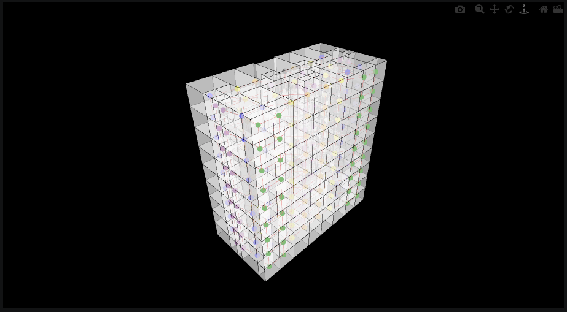

**Adjacency graph, 3D perspective** — geometry removed. The red edges are extremely dense because every shared floor/ceiling slab creates a vertical edge. The staircase becomes a massive hub. This over-connectivity is why the adjacency graph is not used for design or ML:

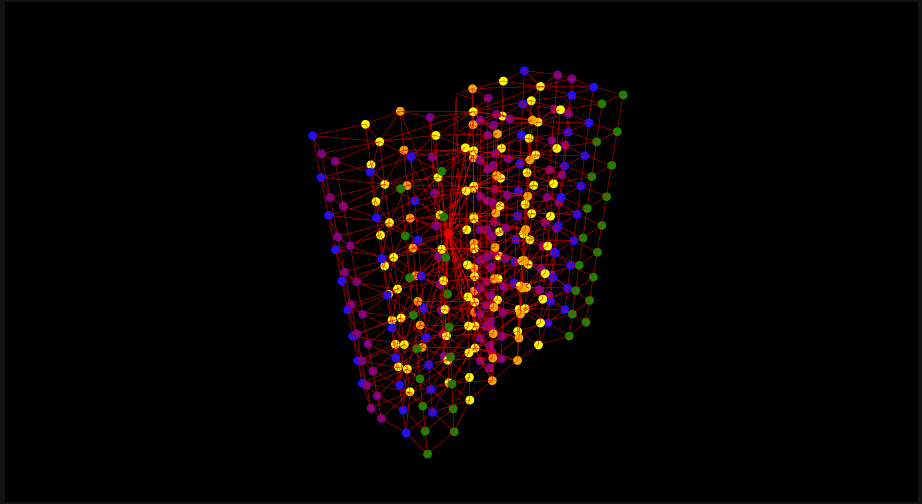

**Adjacency graph, plan view** — collapsing all 9 floors reveals the double-fan structure: two apartment clusters per floor radiate symmetrically from the staircase spine. Through-slab connections converge all floors into the hourglass center:

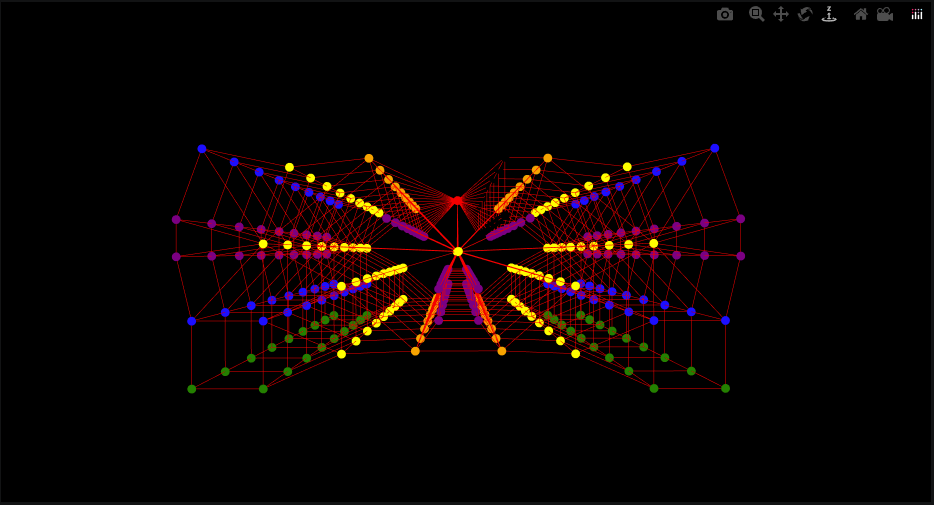

### Access Graph — Intact Section

The access graph (g2) is what drives the design. Only door apertures create edges, so the graph is far sparser and correctly captures circulation paths alone. Bedrooms and bathrooms become leaf nodes; corridors and the landing become the circulation spine; the staircase is the only vertical connector.

**Access graph on geometry** — far fewer edges than the adjacency graph; the through-slab connections are gone:

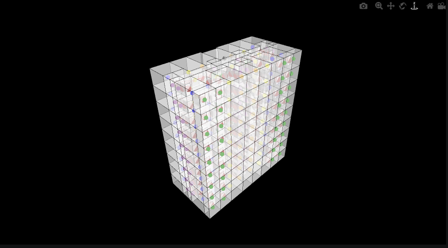

---

## Phase 4: Spatial Analysis

**Still in:** [`MO_Final_Phase3_AccessGraph.ipynb`](MO_Final_Phase3_AccessGraph.ipynb)

Depth from entrance (BFS hop count from the staircase landing node) is computed for every room. This is the key metric that drives Phase 5:

| Depth | Room types found at that depth |
|---|---|
| 0 | Staircase landing (entrance node) |
| 1 | Apartment hall / corridor directly behind entrance door |
| 2 | Rooms connected to the hall: kitchen, bathroom, storeroom |
| 3 | Deeper rooms: bedrooms, living rooms, balconies |

For the memorial design, depth values in the damaged block range from 0 (corridor at landing) to 12 (deepest balcony slabs), producing 13 distinct height levels in the promenade.

---

## Phase 5: The Memorial Design

The depth table feeds directly into the slab height formula:

```
slab_Z = –SLAB_STEP_M × depth_from_entrance
```

Each destroyed room returns as a floor slab at its computed Z height. Slab perimeters are shrunk inward by the missing wall thickness — the gaps are the vanished walls. Door positions become step-bridges at the height difference between two connected rooms.

<!-- PLACEHOLDER: Add Rhino/GH screenshots of the depth-mapped slab promenade — perspective, section, plan -->
<!-- PLACEHOLDER: Add images of newly modeled slabs symbolising the lost apartments -->

---

## Phase 6: Combined Graph

**Notebook:** [`MO_Final_Phase6_CombinedGraph.ipynb`](MO_Final_Phase6_CombinedGraph.ipynb)

The intact section and the damaged block + memorial are merged into one CellComplex. Room type assignments encode the design intent:

| Zone | `room_type` assigned | Why |
|---|---|---|
| Intact section rooms | real type (`bedroom`, `kitchen`, …) | Fully known — not predicted |
| All surviving damaged-block rooms | `corridor` | Neutral in-distribution placeholder; ML predicts new function |
| Memorial slabs | `balcony` | Outdoor / semi-outdoor, zoning class 3 — propagates into adjacent nodes via GraphSAGE |
| Step-bridges | `stairs` | Service / functional, zoning class 2 |

Combined model counts:
```
596 cells loaded (intact + damaged + intervention)
612 apertures total (306 intact + 306 damaged)
```

### Combined CellComplex — Geometry

The full combined building model: the intact section (right, real room types) meets the damaged block with memorial intervention (left, dominated by green balcony slabs). The staircase spine runs at the junction of the two sections:

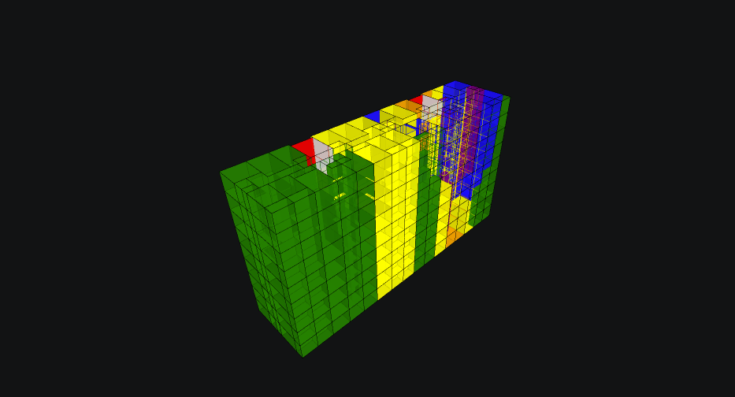

### Adjacency Graph — Combined Section

**Adjacency graph on combined geometry** — both sections visible; the damaged side (left) shows the green balcony slab nodes as a distinct cluster:

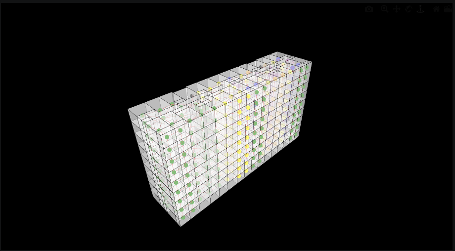

**Combined adjacency graph, 3D perspective** — three zones are now visible: the intact apartment cluster (right), the staircase spine (center), and the memorial intervention cluster (left, with prominent green balcony nodes and sparser red edges):

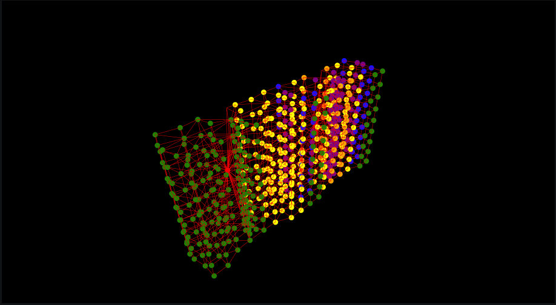

**Combined adjacency graph, plan view** — the broken symmetry is explicit. The intact side (right) retains the tight double-fan apartment pattern. The damaged side (left) fans out differently — the balcony slabs spread outward in a wider, sparser cloud, occupying the spatial footprint of the lost rooms:

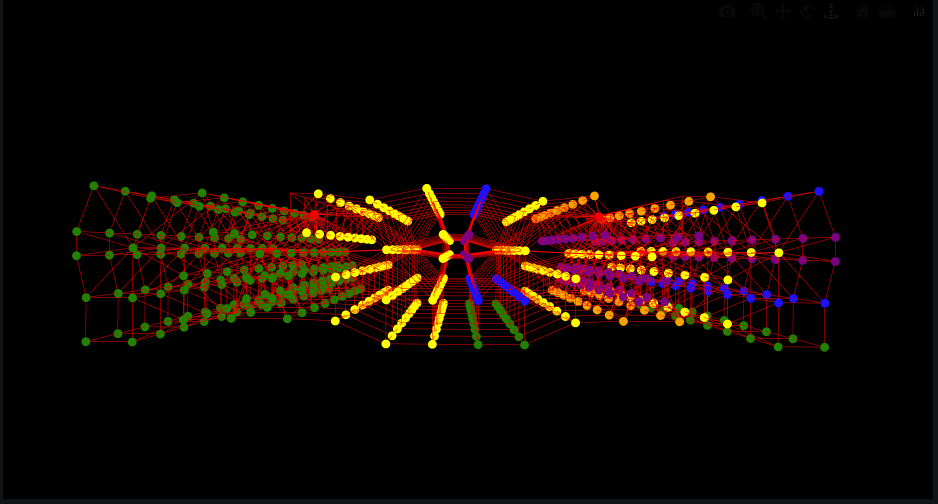

### Access Graph — Combined Section

**Access graph on combined geometry** — edges only where apertures exist; the connection between the two sections runs only through the shared staircase:

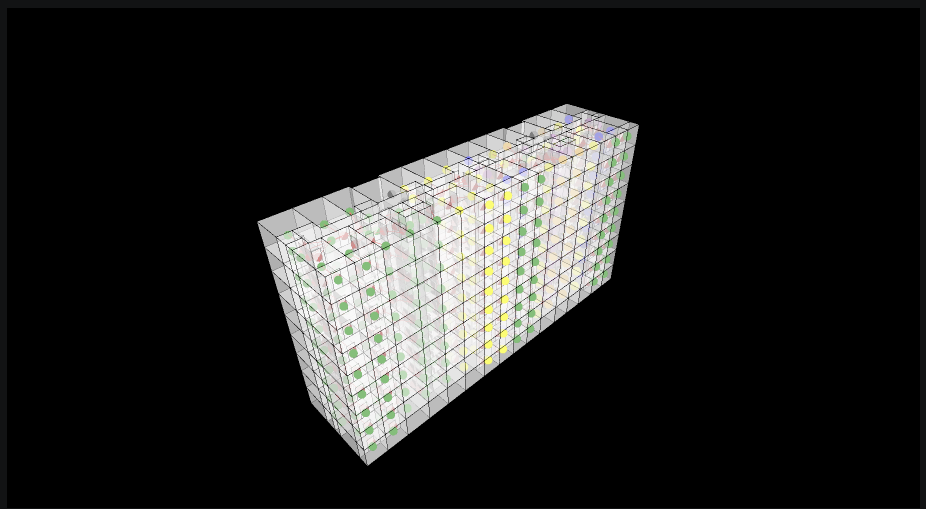

**Combined access graph, 3D perspective** — the contrast between the two halves sharpens in the access graph. The intact side shows the regular apartment tree: corridors branch to rooms, rooms end at leaves (bedrooms, bathrooms, balconies). The damaged side shows the memorial topology: surviving corridor nodes fan out to balcony slabs as dead-end leaves, with stair bridges at their original door positions:

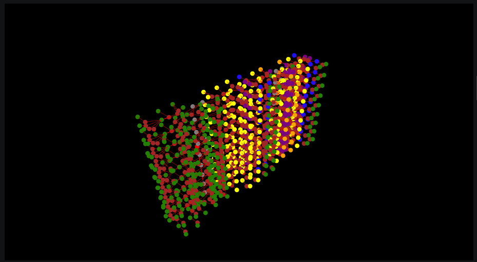

**Combined access graph, plan view** — the staircase sits at the hourglass center. The intact side (right) shows symmetric apartment clusters with leaves at the perimeter. The damaged side (left) shows the memorial's spatial grammar — a different branching structure that carries the graph memory of the lost apartment:

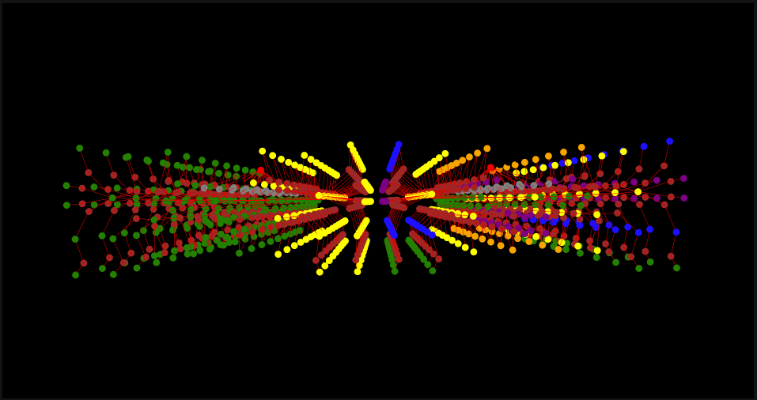

---

## Phase 8: ML Node Classification

**Notebook:** [`S06-15C GML Predict MSD Graph.ipynb`](S06-15C%20GML%20Predict%20MSD%20Graph.ipynb)

### Schema Reference

The nine room types and four zoning classes used by the pretrained GraphSAGE classifier:


### Color Legend

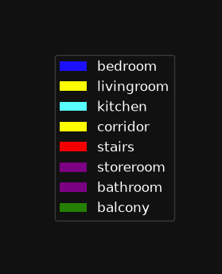

### Feature Design

Each node is described by a **7-dimensional vector** — no geometry, no coordinates:

| Features | Description |
|---|---|
| `feat_zoning_type_0..3` | One-hot encoding of the room's zoning class (4 dims) |
| `feat_connectivity_0` | Proportion of incident edges that are `passage` (open threshold) |
| `feat_connectivity_1` | Proportion of incident edges that are `door` (leaf door) |
| `feat_connectivity_2` | Proportion of incident edges that are `entrance_door` |

The surviving damaged-block rooms receive `corridor` → zoning `[0,1,0,0]`. The model must then disambiguate among `livingroom`, `kitchen`, `dining`, `corridor` using the connectivity pattern and what neighbours (balcony slabs, stair bridges) look like after GraphSAGE aggregation.

### Dataset

```
graphs.csv:  1 graph
nodes.csv:   596 nodes
edges.csv:   594 undirected edges (1188 directed)

label distribution:
  0 bedroom:    54
  1 livingroom: 36
  2 kitchen:    36
  4 corridor:  162  ← surviving damaged-block rooms (placeholder)
  5 stairs:      2
  6 storeroom:  18
  7 bathroom:   72
  8 balcony:   216  ← memorial slabs (design-assigned, not predicted)
```

### Existing Labels — Before Inference

The graph colored by **assigned** labels before ML runs. The damaged section (left cluster) shows the placeholder assignment: yellow nodes are the `corridor` survivors, green nodes are the `balcony` memorial slabs. The intact section (right) shows the full room-type diversity.

**3D perspective — assigned labels:**

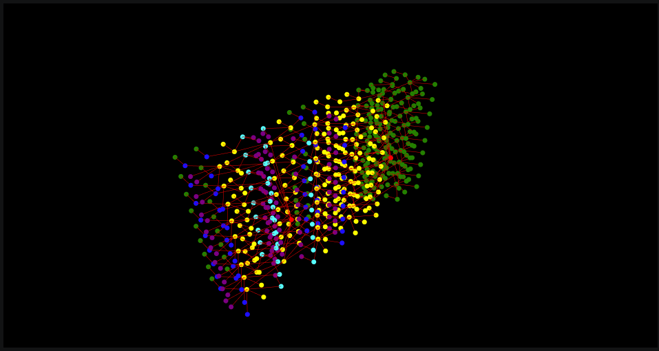

**Plan view — assigned labels:**

The plan view makes the asymmetry between the two sections explicit: the intact side (right fan) shows the full color palette of a real apartment; the damaged side (left fan) is almost entirely yellow (corridor) and green (balcony) — the uniform placeholder waiting for the model's interpretation:

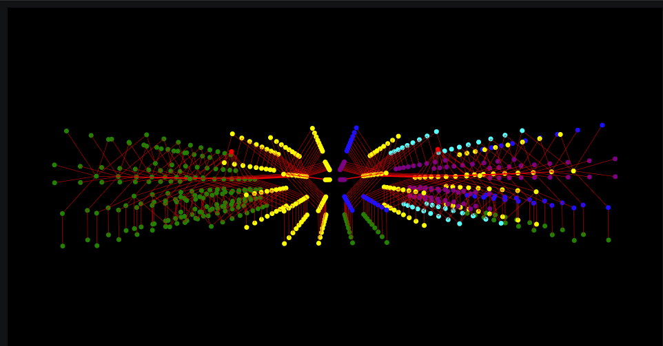

### ML Predictions — After Inference

The graph colored by **ML predicted** labels. The key change is in the damaged section: cyan (`kitchen`) nodes now appear among the yellow corridors. The model has read the connectivity pattern of those rooms — 2–3 door edges, mixed balcony and corridor neighbours — and matched it to its learned kitchen profile.

**3D perspective — predicted labels:**

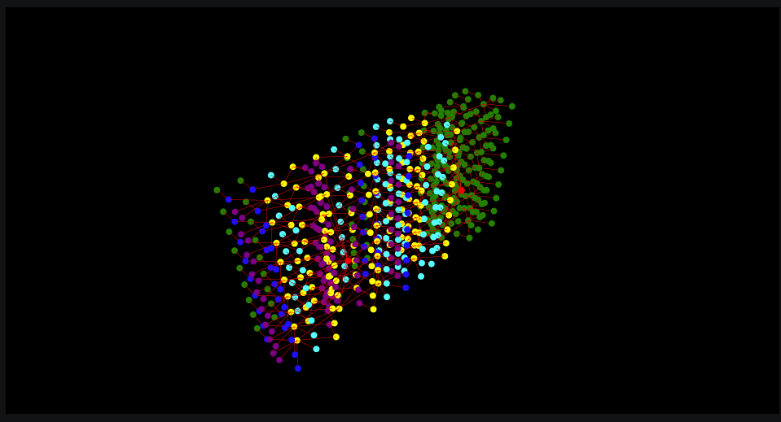

**Plan view — predicted labels:**

The plan view reveals where the model's reclassification concentrates: the cyan kitchen nodes appear in the rings closest to the staircase hub, where surviving corridor rooms have the mixed door/balcony connectivity that the GraphSAGE model associates with kitchens. Rooms at greater depth from the entrance tend to remain `corridor`:

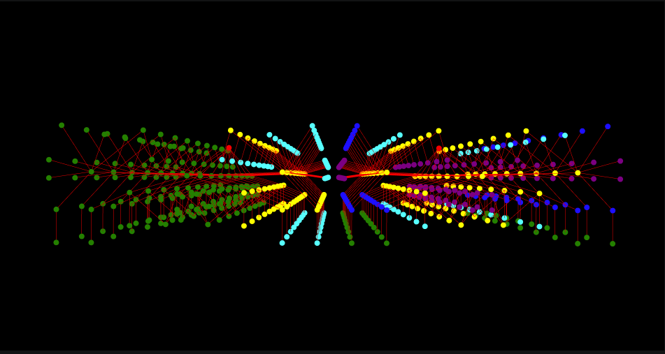

### Prediction Results

For the 162 surviving damaged-block rooms (y_true = `corridor` placeholder):

```
corridor:    90 nodes  — still read as circulation
kitchen:     63 nodes  — mixed door/balcony connectivity → kitchen profile
livingroom:   9 nodes  — single-door connection to large balcony or corridor
```

| Node group | y_true | y_pred | Count |
|---|---|---|---|
| Intact section (real types) | real type | matches real type | sanity check |
| **Surviving damaged rooms** | `corridor` (placeholder) | **kitchen / corridor / livingroom** | **162** |
| Memorial slabs | `balcony` | `balcony` (echoes design) | 216 |
| Step-bridges | `stairs` | `stairs` (echoes design) | 2 |

### Affected Block — Comparison and Prediction Panels

Graph view of the damaged section only — existing state (left) versus ML predicted functions (right):


Floor-by-floor grid view — each row is one floor, each dot is one room. Left: placeholder labels. Right: what the model predicts each space becomes in the memorial context:


---

## Design–Analysis Loop

The project's contribution is that graph analysis is not documentation after the fact — it **generates the form**:

1. Build access graph of intact section → compute depth from entrance (Phase 3–4)
2. Map depth to slab height → produce the memorial geometry (Phase 5)
3. Re-embed the memorial as `balcony` + `stairs` nodes in the combined graph (Phase 6)
4. Run ML inference → balcony neighbours change the feature vectors of adjacent corridor nodes → 63 rooms are predicted as `kitchen`, 9 as `livingroom` (Phase 8)

The loop closes: the design choice (labeling the slabs `balcony`, connecting them with `door` edges) affects the ML result. The ML result is a reading of the memorial's spatial quality — what it would feel like to inhabit, according to a model trained on thousands of real apartments.

---

## Room Type & Zoning Reference

| `room_type` | `label` | Zoning | Meaning |
|---|---:|---:|---|
| `bedroom` | 0 | 0 | Private / static |
| `livingroom` | 1 | 1 | Living / dynamic |
| `kitchen` | 2 | 1 | Living / dynamic |
| `dining` | 3 | 1 | Living / dynamic |
| `corridor` | 4 | 1 | Living / dynamic |
| `stairs` | 5 | 2 | Service / functional |
| `storeroom` | 6 | 2 | Service / functional |
| `bathroom` | 7 | 2 | Service / functional |
| `balcony` | 8 | 3 | Outdoor / semi-outdoor |

| `door_type` | Edge feature | Meaning |
|---|---|---|
| `passage` | `feat_connectivity_0 = 1` | Open threshold — no door leaf |
| `door` | `feat_connectivity_1 = 1` | Room-to-room leaf door |
| `entrance_door` | `feat_connectivity_2 = 1` | Apartment entrance from stair landing |

---

## Files

| File | Role |
|---|---|
| [`MO_Final_Phase3_AccessGraph.ipynb`](MO_Final_Phase3_AccessGraph.ipynb) | Phases 3 + 4: intact section graph construction and spatial analysis |
| [`MO_Final_Phase6_CombinedGraph.ipynb`](MO_Final_Phase6_CombinedGraph.ipynb) | Phase 6 + ML prep: combined graph, feature encoding, CSV export |
| [`S06-15C GML Predict MSD Graph.ipynb`](S06-15C%20GML%20Predict%20MSD%20Graph.ipynb) | Phase 8: ML inference and visualization |
| [`S06-15B GML Prepare Graph for Node Classification.ipynb`](S06-15B%20GML%20Prepare%20Graph%20for%20Node%20Classification.ipynb) | ML helper — `CheckMSDGraphPreparation` + `EncodeMSDGraphFeatures` |
| `msd_node_classifier.pt` | Pretrained GraphSAGE model (inference only — never retrain) |
| `dataset/` | `graphs.csv`, `nodes.csv`, `edges.csv`, `meta.yaml`, `node_predictions_baseline.csv` |
| `assets/3d/` | OBJ room and door files for both sections |
| `assets/2d/presentation/` | Graph visualization exports used in this document |
| `pipeline_build_guide.md` | Full 8-phase pipeline specification |
